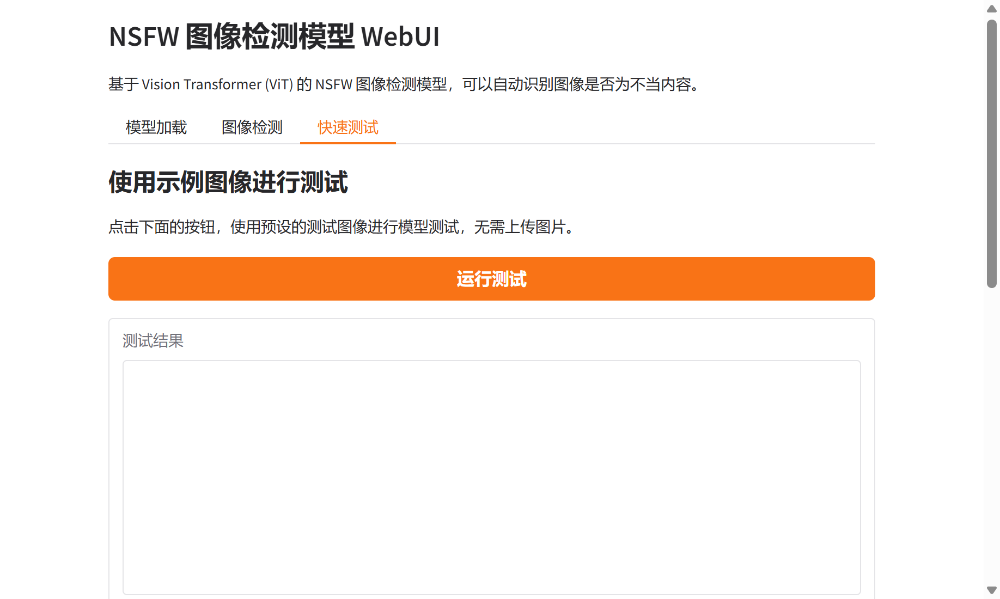

# NSFW 图像检测模型 WebUI

## 项目概述

本项目基于 HuggingFace 上的 Falconsai/nsfw_image_detection 模型，构建了一个基于 Gradio 框架的交互式 Web 用户界面，用于实现 NSFW（Not Safe For Work，不当内容）图像的自动检测与分类。该模型采用 Vision Transformer (ViT) 架构，经过大规模数据集的预训练和精细调优，能够有效识别图像中的不当内容，为内容审核、安全过滤等应用场景提供技术支持。

## 模型技术原理

### Vision Transformer 架构

Vision Transformer (ViT) 是近年来在计算机视觉领域取得突破性进展的深度学习架构，它将自然语言处理中广泛应用的 Transformer 架构成功迁移到图像处理任务中。与传统的卷积神经网络（CNN）不同，ViT 将输入图像分割成固定大小的图像块（patches），每个图像块被线性投影为嵌入向量，并添加位置编码信息，形成序列化的输入表示。这种设计使得模型能够利用自注意力机制（Self-Attention）捕获图像中不同区域之间的长距离依赖关系，从而在图像分类任务中表现出色。

### 模型训练与优化

Falconsai/nsfw_image_detection 模型基于 ViT 架构，在 ImageNet-21k 数据集上进行了大规模预训练，该数据集包含超过 1400 万张图像和 21841 个类别，为模型提供了丰富的视觉特征表示能力。随后，模型在包含 80,000 张图像的高质量专有数据集上进行了精细调优，该数据集涵盖了正常内容和不当内容的多样化场景，确保了模型在实际应用中的泛化性能。

训练过程中采用了批量大小为 16、学习率为 5e-5 的超参数配置，这些参数的选择基于大量的实验验证，能够在保证训练稳定性的同时实现良好的收敛效果。模型支持 224×224 像素的输入分辨率，这一分辨率在计算效率和特征提取能力之间取得了良好的平衡。

### 分类机制

模型将输入图像分类为两个主要类别："normal"（正常内容）和 "nsfw"（不当内容）。在推理过程中，模型首先通过 ViT 编码器提取图像的深层特征表示，然后通过分类头输出每个类别的对数概率（logits），最后通过 Softmax 函数转换为概率分布。系统根据概率值的大小确定最终的分类结果，并输出相应的置信度分数，为用户提供决策参考。

## 系统实现

### 技术栈

本 WebUI 系统采用 Python 作为主要开发语言，利用 Gradio 框架构建交互式用户界面。Gradio 是一个专门为机器学习模型快速构建 Web 界面的开源框架，它提供了丰富的组件和简洁的 API，使得开发者能够快速将模型部署为可访问的 Web 应用。系统使用 Transformers 库加载和运行预训练模型，该库由 HuggingFace 开发维护，提供了统一的接口来访问和使用各种预训练模型。

### 系统架构

系统采用模块化设计，主要包含三个核心模块：模型加载模块、图像检测模块和快速测试模块。模型加载模块负责从 HuggingFace Hub 下载并初始化模型，支持本地缓存机制，首次加载后可将模型文件保存到本地，后续使用时可显著减少加载时间。图像检测模块提供图像上传功能，用户可以通过拖拽或点击的方式上传待检测图像，系统自动进行预处理、推理和后处理，并将结果以直观的方式呈现给用户。快速测试模块内置了示例图像生成功能，用户无需手动上传图片即可快速验证模型的检测能力，这一设计特别适合自动化测试和演示场景。

### 用户交互设计

为了提升用户体验并支持自动化测试，系统在设计时充分考虑了交互的便捷性。传统的文件上传方式需要用户手动选择文件，这在自动化测试场景中可能面临技术障碍。因此，系统特别设计了"快速测试"功能，通过预设的测试图像和按钮触发机制，避免了复杂的文件交互操作。这种设计不仅提升了用户体验，也为使用 Playwright 等自动化测试工具提供了便利。

## 部署与使用

### 环境配置

系统运行需要 Python 3.8 及以上版本，主要依赖包包括 Gradio（版本 4.0.0 及以上）、PyTorch（版本 1.9.0 及以上）、Transformers（版本 4.20.0 及以上）等。用户可以通过 pip 安装 requirements.txt 文件中列出的所有依赖包，确保运行环境的完整性。

### 模型下载

系统支持两种模型加载方式：在线加载和本地加载。在线加载模式下，模型会在首次使用时自动从 HuggingFace Hub 下载，这种方式简单便捷，但需要稳定的网络连接。本地加载模式下，用户可以预先运行 download_model.py 脚本将模型文件下载到本地，后续使用时直接从本地加载，这种方式可以显著提升加载速度并减少网络依赖。

### 启动与访问

启动系统只需运行 `python app.py` 命令，系统会自动初始化 Gradio 服务器并监听 7860 端口。启动成功后，用户可以通过浏览器访问 `http://localhost:7860` 来使用 WebUI。系统界面采用响应式设计，支持不同尺寸的屏幕显示，用户可以通过标签页切换不同的功能模块。

### 使用流程

用户首先进入"模型加载"标签页，点击"加载模型"按钮初始化模型。模型加载过程可能需要一定时间，特别是首次使用时需要从网络下载模型文件。加载成功后，系统会显示"模型加载成功！"的提示信息。随后，用户可以选择"图像检测"标签页上传待检测图像，或选择"快速测试"标签页使用预设图像进行测试。检测完成后，系统会显示分类结果、置信度分数以及详细的概率分布信息，帮助用户理解模型的判断依据。

## 应用场景

NSFW 图像检测技术在多个领域具有重要的应用价值。在内容审核领域，该技术可以帮助社交媒体平台、论坛、博客等网站自动识别和过滤不当内容，保护用户免受不良信息的影响。在搜索引擎和推荐系统中，该技术可以用于内容过滤，确保向用户推荐的内容符合相关规范和用户期望。在云存储和文件共享服务中，该技术可以用于自动扫描上传的文件，防止不当内容的传播。此外，该技术还可以应用于企业内网的内容安全监控、教育平台的资源审核等场景。

## 技术优势与局限

### 技术优势

基于 Vision Transformer 的 NSFW 检测模型具有多个技术优势。首先，ViT 架构的自注意力机制能够有效捕获图像中的全局特征和长距离依赖关系，这对于理解图像的整体语义内容具有重要意义。其次，模型在大规模数据集上的预训练使其具备了强大的特征表示能力，能够识别各种复杂场景下的不当内容。此外，模型的二分类设计简洁高效，推理速度快，能够满足实时检测的需求。

### 技术局限

尽管模型在多个场景下表现良好，但仍存在一些技术局限。首先，模型的性能很大程度上依赖于训练数据的质量和多样性，对于某些特殊场景或边缘情况，模型可能会出现误判。其次，模型主要针对静态图像进行检测，对于视频内容需要逐帧处理，计算成本较高。此外，模型的判断标准可能因文化背景、社会规范等因素而存在差异，在实际应用中需要结合人工审核进行综合判断。

## 未来发展方向

随着深度学习技术的不断发展，NSFW 图像检测技术也在持续演进。未来可能的发展方向包括：多模态融合技术，结合图像、文本、音频等多种信息源进行综合判断；实时视频流检测技术，支持对视频内容的实时监控和过滤；细粒度分类技术，不仅区分正常和不当内容，还能进一步细分不当内容的类型和严重程度；可解释性增强技术，提供更详细的检测依据和可视化分析，帮助用户理解模型的判断过程。

## 相关资源

更多类似的精品项目和技术资源，欢迎访问以下平台获取：

- [Vision Studios](https://www.visionstudios.cloud) - 专业的视觉AI解决方案平台
- [Vision Studio](https://www.visionstudio.cloud) - 创新的视觉技术研究与应用
- [Vision Studios Art](https://visionstudios.art) - 艺术与技术的完美结合
- [群山科技](https://www.qunshankj.com) - 前沿AI技术研发与应用
- [Vision Studios Ltd](https://www.visionstudios.ltd) - 企业级AI解决方案提供商

## 原始项目信息

本项目基于 HuggingFace 上的 Falconsai/nsfw_image_detection 模型开发，原始项目地址：https://hf-mirror.com/Falconsai/nsfw_image_detection

原始模型由 Falcons.ai 团队开发维护，采用 Apache 2.0 开源许可证，模型大小约 1.46 GB，在 HuggingFace 平台上获得了广泛关注和认可。

## 许可证

本项目遵循 Apache 2.0 开源许可证，用户可以自由使用、修改和分发代码，但需保留原始许可证声明。

## 贡献与反馈

欢迎用户提交问题报告、功能建议或代码贡献。如果您在使用过程中遇到任何问题，或有改进建议，请通过 GitHub Issues 与我们联系。