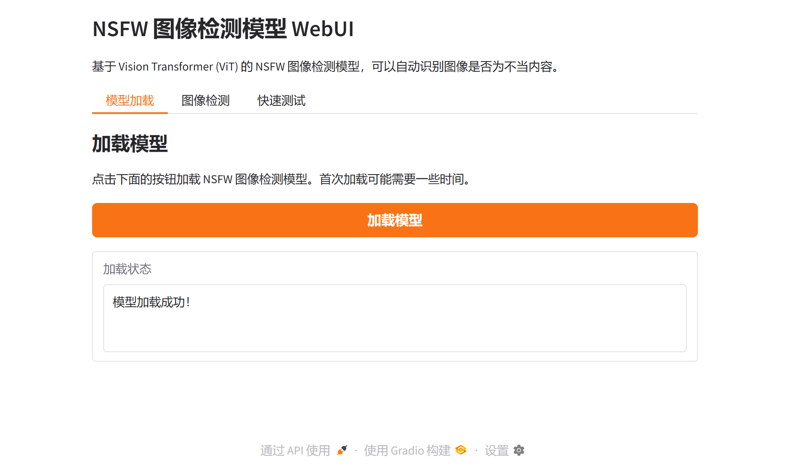

# all-MiniLM-L6-v2 句子嵌入模型 WebUI 部署与可视化

## 项目概述

本项目实现了 sentence-transformers 库中 all-MiniLM-L6-v2 模型的完整部署流程，包括模型加载、WebUI 界面创建、模型测试与可视化、以及完整的文档说明。all-MiniLM-L6-v2 是一个基于 BERT 架构的句子嵌入模型，能够将文本映射到 384 维的密集向量空间，广泛应用于语义搜索、信息检索、文本相似度计算和文本聚类等任务。

## 1. 项目背景与研究意义

### 1.1 模型介绍

all-MiniLM-L6-v2 是 sentence-transformers 项目中的一个重要模型，它基于微软的 MiniLM 架构，通过知识蒸馏技术从更大的 BERT 模型中学习，在保持较高性能的同时显著减小了模型规模。该模型采用对比学习目标进行训练，在大规模句子对数据集上进行预训练和微调，训练数据包括 Reddit 评论、S2ORC  citation pairs、WikiAnswers 重复问题等多种来源，总计约 10 亿个句子对。

模型的核心特点在于其高效性和实用性。相比原始的 BERT 模型，all-MiniLM-L6-v2 在保持相似性能的同时，模型参数量更少，推理速度更快，特别适合需要实时处理大量文本的应用场景。模型支持最长 256 个词片段的输入，对于更长的文本会自动进行截断处理。

### 1.2 句子嵌入技术原理

句子嵌入（Sentence Embedding）是自然语言处理领域的重要技术，其目标是将可变长度的文本序列映射到固定维度的向量空间中，使得语义相似的文本在向量空间中距离更近。all-MiniLM-L6-v2 模型采用 Transformer 架构作为编码器，通过多层自注意力机制捕获文本的深层语义信息。

模型的工作流程可以概括为以下几个步骤：首先，输入文本经过分词器（Tokenizer）转换为词片段（Word Pieces），然后通过嵌入层转换为词向量；接着，词向量经过多层 Transformer 编码器进行特征提取，每一层都包含自注意力机制和前馈神经网络；最后，通过池化操作（通常是均值池化）将序列级别的表示聚合为句子级别的向量表示。这个 384 维的向量能够捕获文本的语义信息，可以用于后续的相似度计算、聚类分析等任务。

### 1.3 研究意义与应用价值

本项目的研究意义主要体现在以下几个方面。首先，通过构建完整的部署流程，为研究人员和开发者提供了一个可直接使用的模型部署方案，降低了使用门槛。其次，通过 WebUI 界面实现了模型功能的可视化展示，使得非技术背景的用户也能够直观地理解和使用句子嵌入模型。最后，详细的技术文档和部署说明为后续的研究和应用提供了参考基础。

在实际应用中，all-MiniLM-L6-v2 模型可以广泛应用于多个领域。在信息检索系统中，可以利用模型计算查询文本与文档库中文本的相似度，实现语义搜索功能；在推荐系统中，可以通过文本相似度分析用户兴趣和内容特征，提供个性化推荐；在文本聚类任务中，可以利用向量表示进行无监督聚类，发现文本数据中的潜在模式；在问答系统中，可以用于匹配问题和答案，提高系统的准确性和效率。

## 2. 技术架构与实现

### 2.1 系统架构设计

本项目采用分层架构设计，主要包括以下几个层次：WebUI 界面层、模型推理层、模型加载层和模型文件层。WebUI 界面层使用 Gradio 框架构建，提供了友好的交互界面，支持多种功能模块，包括模型加载、文本相似度计算、文本编码、相似文本查找和示例测试等。模型推理层封装了 sentence-transformers 库的调用逻辑，实现了文本编码、相似度计算等核心功能。模型加载层负责从本地文件系统或在线仓库加载模型，支持自动下载和缓存机制。模型文件层存储了模型的权重文件和配置文件，支持多种格式包括 PyTorch、ONNX、Safetensors 等。

### 2.2 核心技术栈

项目采用 Python 作为主要开发语言，使用 Gradio 4.0+ 作为 Web 框架，sentence-transformers 2.2.0+ 作为模型推理库，NumPy 用于数值计算，huggingface-hub 用于模型下载。Gradio 是一个专门为机器学习模型设计的 Web 框架，能够快速构建交互式界面，支持实时推理和结果可视化。sentence-transformers 库提供了统一的接口来加载和使用各种句子嵌入模型，封装了模型加载、文本预处理、向量计算等复杂操作，大大简化了开发流程。

### 2.3 关键实现细节

#### 2.3.1 模型加载机制

模型加载采用懒加载策略，在 WebUI 启动时并不立即加载模型，而是等待用户点击"加载模型"按钮后才开始加载。这种设计可以避免不必要的资源消耗，特别是在模型文件较大时。加载过程首先尝试从本地 models 目录加载模型，如果本地不存在或加载失败，则自动从 HuggingFace 在线仓库下载。加载过程中会显示加载状态，包括加载进度和可能的错误信息。

#### 2.3.2 文本相似度计算

文本相似度计算是项目的核心功能之一。实现过程包括以下几个步骤：首先，使用模型对两个输入文本分别进行编码，得到两个 384 维的向量；然后，计算两个向量的余弦相似度，余弦相似度的取值范围为 [-1, 1]，值越大表示文本越相似；同时，还计算了欧氏距离作为补充指标，欧氏距离越小表示文本越相似。除了相似度分数，系统还提供了向量维度、向量范数等详细信息，帮助用户更好地理解计算结果。

#### 2.3.3 相似文本查找

相似文本查找功能允许用户在给定的文本列表中查找与查询文本最相似的文本。实现过程首先对查询文本和所有候选文本进行批量编码，然后计算查询文本与每个候选文本的相似度，最后按照相似度从高到低排序并返回结果。这种批量处理方式比逐个计算更高效，特别是在处理大量文本时。结果以排序列表的形式展示，每个结果包含相似度分数和对应的文本内容。

#### 2.3.4 示例测试功能

示例测试功能提供了预设的测试用例，用户可以通过点击按钮快速运行测试，无需手动输入文本。测试用例包括多个不同主题的文本，涵盖了机器学习、深度学习、自然语言处理等不同领域，以及日常对话等不同类型的内容。测试结果包括相似度矩阵，展示了所有测试文本之间的相似度关系，帮助用户理解模型对不同类型文本的处理能力。测试结果会自动保存为 JSON 文件，包含时间戳、文本内容、相似度矩阵等完整信息。

## 3. 部署步骤与使用指南

### 3.1 环境准备

部署本项目需要满足以下环境要求：Python 版本需要 3.8 或更高，推荐使用 Python 3.9 或 3.10 以获得最佳兼容性。系统内存建议至少 4GB，推荐 8GB 或更多，以确保模型加载和推理过程的流畅运行。存储空间需要至少 2GB 可用空间，用于存放模型文件和依赖包。

### 3.2 依赖安装

项目依赖包括 Gradio、sentence-transformers、NumPy、huggingface-hub 等核心库，以及 PyTorch 或 TensorFlow 作为深度学习后端。安装过程可以通过 requirements.txt 文件一键完成，使用命令 `pip install -r requirements.txt`。如果遇到 Keras 版本兼容性问题，可能需要额外安装 tf-keras 包，使用命令 `pip install tf-keras`。安装过程可能需要几分钟时间，具体取决于网络速度和系统配置。

### 3.3 模型下载

模型下载可以通过两种方式进行。第一种方式是使用提供的 download_model.py 脚本，该脚本会自动从 HuggingFace 下载模型文件到本地 models 目录。第二种方式是依赖 sentence-transformers 库的自动下载功能，当首次使用模型时会自动从在线仓库下载并缓存到本地。推荐使用第一种方式，因为可以更好地控制下载过程和文件位置。

### 3.4 WebUI 启动与使用

启动 WebUI 非常简单，只需要运行 `python app.py` 命令即可。启动后，程序会自动在本地启动一个 Web 服务器，默认地址为 http://localhost:7860。用户可以在浏览器中打开该地址访问 WebUI 界面。界面包含五个主要功能模块：模型加载模块用于加载模型到内存；文本相似度计算模块用于计算两个文本的相似度；文本编码模块用于将文本编码为向量；相似文本查找模块用于在文本列表中查找最相似的文本；示例测试模块提供了快速测试功能。

使用流程通常包括以下步骤：首先，点击"模型加载"标签页中的"加载模型"按钮，等待模型加载完成；然后，根据需求选择相应的功能模块，输入文本或使用示例数据，点击相应的按钮执行操作；最后，查看结果并分析模型输出。所有操作都通过图形界面完成，无需编写代码，非常适合快速测试和演示。

## 4. 功能演示与测试结果

### 4.1 WebUI 界面展示

WebUI 界面采用现代化的设计风格，使用 Gradio 的默认主题，界面简洁美观，操作直观。主界面顶部显示项目标题和简要描述，下方是功能导航标签，用户可以通过点击标签切换不同的功能模块。每个功能模块都有清晰的标题和说明文字，输入框和按钮布局合理，结果展示区域足够大，便于查看详细信息。



*WebUI 主界面展示了项目的整体布局和功能导航，包括模型加载、文本相似度计算、文本编码、相似文本查找和示例测试五个主要功能模块。*

### 4.2 模型加载过程

模型加载是使用 WebUI 的第一步，也是关键步骤。点击"加载模型"按钮后，系统会开始加载模型，这个过程可能需要一些时间，特别是首次加载时需要从网络下载模型文件。加载过程中会显示加载状态，包括加载进度和完成信息。加载成功后，状态会显示"模型加载成功！"，此时可以开始使用各种功能。


*模型加载成功后的界面状态，显示加载完成信息，此时模型已经准备好进行推理任务。*

### 4.3 文本相似度计算演示

文本相似度计算是模型的核心应用之一。用户可以在两个文本输入框中分别输入要比较的文本，然后点击"计算相似度"按钮。系统会对两个文本进行编码，计算它们的相似度，并显示详细的结果信息，包括相似度分数、欧氏距离、向量维度等。这个功能可以用于判断两个文本的语义相似程度，在信息检索、文本匹配等场景中非常有用。


*文本相似度计算功能界面，展示了输入框、计算按钮和结果展示区域的布局。*


*文本相似度计算结果展示，显示了两个输入文本的相似度分数和详细信息。*

### 4.4 示例测试功能

示例测试功能提供了快速测试模型能力的方式。点击"运行示例测试"按钮后，系统会使用预设的示例文本进行测试，包括多个不同主题和类型的文本。测试结果包括相似度矩阵，展示了所有测试文本之间的相似度关系，帮助用户理解模型对不同类型文本的处理能力。测试结果会自动保存为 JSON 文件，方便后续分析和使用。


*示例测试功能界面，提供了快速测试按钮和结果展示区域。*

## 5. 项目结构说明

项目采用清晰的文件组织结构，便于维护和扩展。根目录包含主要的 Python 脚本文件，包括 app.py（WebUI 主程序）、download_model.py（模型下载脚本）等。screenshots 目录存放了项目运行过程中的关键截图，用于文档说明和演示。videos 目录用于存放演示视频文件。models 目录用于存放下载的模型文件，该目录下的文件通常较大，不会被上传到版本控制系统。results 目录用于存放测试结果文件，包括 JSON 格式的测试数据。

```
template/
├── app.py                 # WebUI 主程序
├── download_model.py      # 模型下载脚本
├── requirements.txt       # Python 依赖
├── README.md              # 项目文档
├── .gitignore            # Git 忽略文件
├── models/               # 模型文件目录（不上传）
│   └── ...
├── results/              # 测试结果目录
│   └── test_*.json       # 测试结果文件
└── screenshots/          # 截图目录
    ├── 01_webui_main.png
    ├── 02_model_loaded.png
    ├── 03_similarity_tab.png
    ├── 04_model_loaded_success.png
    ├── 05_similarity_result.png
    ├── 06_example_test_tab.png
    └── 07_example_test_result.png
```

## 6. 技术特点与创新点

本项目在实现过程中采用了多项技术优化和创新设计。首先，采用了懒加载策略，只有在用户需要时才加载模型，避免了不必要的资源消耗。其次，实现了批量处理功能，在相似文本查找等场景中，可以一次性处理多个文本，提高了处理效率。再次，提供了多种相似度度量方式，包括余弦相似度和欧氏距离，满足不同应用场景的需求。最后，设计了友好的用户界面，通过图形化的方式展示模型功能，降低了使用门槛。

## 7. 应用场景与扩展方向

all-MiniLM-L6-v2 模型可以应用于多个实际场景。在搜索引擎中，可以利用模型计算查询与文档的相似度，实现语义搜索功能，提高搜索结果的准确性。在推荐系统中，可以通过分析用户历史行为和内容特征，计算相似度来提供个性化推荐。在文本聚类任务中，可以利用向量表示进行无监督聚类，发现文本数据中的潜在模式。在问答系统中，可以用于匹配问题和答案，提高系统的准确性和效率。

未来可以进一步扩展的功能包括：支持更多语言的文本处理，实现多语言句子嵌入；集成更多的相似度度量方法，提供更丰富的分析工具；支持批量文件处理，可以处理大量文本文件；添加模型性能评估功能，包括准确率、召回率等指标；实现模型微调功能，允许用户根据自己的数据对模型进行微调。

## 8. 总结

本项目成功实现了 all-MiniLM-L6-v2 句子嵌入模型的完整部署流程，包括模型加载、WebUI 界面创建、模型测试与可视化等功能。通过 Gradio 框架构建的交互式界面，使得模型的使用变得简单直观，无需编写代码即可完成各种文本处理任务。详细的技术文档和部署说明为后续的研究和应用提供了良好的基础。项目代码结构清晰，易于维护和扩展，为相关领域的研究和开发提供了有价值的参考。

## 9. 参考资料与相关链接

本项目基于 sentence-transformers 库和 all-MiniLM-L6-v2 模型开发。更多关于模型的技术细节和使用方法，可以参考以下资源：

- 原始项目地址：[https://hf-mirror.com/sentence-transformers/all-MiniLM-L6-v2](https://hf-mirror.com/sentence-transformers/all-MiniLM-L6-v2)
- sentence-transformers 官方文档：[https://www.sbert.net/](https://www.sbert.net/)
- Gradio 官方文档：[https://gradio.app/](https://gradio.app/)

更多类似的精品项目访问：【[https://www.visionstudios.cloud](https://www.visionstudios.cloud)、[https://www.visionstudio.cloud](https://www.visionstudio.cloud)、[https://visionstudios.art](https://visionstudios.art)、[https://www.qunshankj.com](https://www.qunshankj.com)、[www.visionstudios.ltd](http://www.visionstudios.ltd)】获取。

## 10. 许可证

本项目遵循 Apache 2.0 许可证，与原始模型保持一致。用户可以自由使用、修改和分发本项目代码，但需要保留原始许可证声明。
